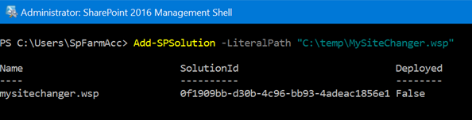
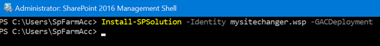

# sp-mysite-changer

## Deploy this in SharePoint 2016

1. Run __SharePoint 2016 Management Shell__ as Administrator
2. Add the solution into SharePoint Farm
    ```ps
    Add-SPSolution -LiteralPath "C:\temp\MySiteChanger.wsp"
    ```
    
3. Install the solution in the SharePoint Farm
    ```ps
    Install-SPSolution -Identity mysitechanger.wsp -GACDeployment
    ```
    
4. Open SharePoint Central Administation, click __System Settings__, __Manage Farm Solutions__ (Under __Farm Management__), double check the deployment is done. (_If the system prompts __Error 503__, it means the deployment is in progress._)

    
5. Enter __Web Application Management__, double check below feature is activated on the Web Application that hosts MySite.

    
6. If _Fast Creation_ is opened for MySite, then back to the __SharePoint 2016 Management Shell__, find the _Content Database_ of MySite host. (_Remember to replace the Url_)
    ```ps
    Get-SPSite('http://ip/my') | select ContentDatabase
    ```
    
7. Copy the _ContentDatabase Name_ and execute below command to retrieve _SiteMaster_ (_Remember to replace the DatabaseName_)
    ```ps
    Get-SPSiteMaster -ContentDatabase 'WSS_Content_26a746887080403291121058a984bc7c'
    ```
    
8. If there has any output from last command, check if the _TemplateName_ is __SPSPERS#10__. If __Yes__, copy the _SiteId_ and execute below command. (_Remember to replace the Id_)
    ```ps
    Remove-SPSite('e5e005cf-5ac6-4b5b-b8d2-2521cc1f2aec')
    ```
    